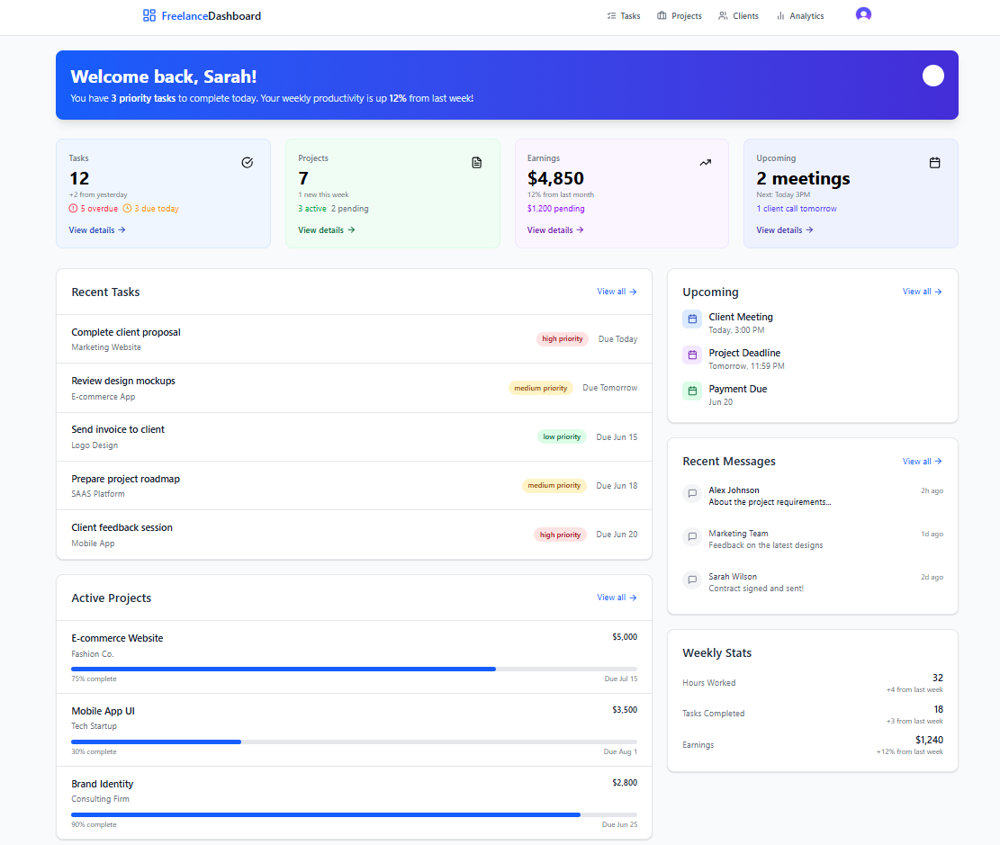

# Freelance Dashboard



A comprehensive task management solution for freelancers with project tracking, client management, and productivity analytics.

## Table of Contents
- [Features](#features)
- [Tech Stack](#tech-stack)
- [Installation](#installation)
- [Configuration](#configuration)
- [Project Structure](#project-structure)
- [Available Scripts](#available-scripts)
- [Deployment](#deployment)
- [Customization](#customization)
- [Contributing](#contributing)
- [License](#license)
- [Support](#support)

## Features ✨

### Core Functionality
- **Task Management** with priorities and deadlines
- **Project Tracking** with progress indicators
- **Client Database** with contact management
- **Earnings Analytics** with visual charts
- **Calendar Integration** for scheduling

### User Experience
- 🔒 Secure authentication with Clerk
- 📱 Fully responsive design
- 🎨 Customizable dashboard
- ⚡ Fast performance with Next.js
- 📊 Data visualization with Chart.js

## Tech Stack 🛠️

**Frontend:**
- Next.js 14 (App Router)
- TypeScript
- Tailwind CSS
- Lucide React (icons)

**Backend Services:**
- Clerk (Authentication)
- NextAuth.js (Fallback)

**Utilities:**
- date-fns (Date formatting)
- react-hot-toast (Notifications)
- clsx (Conditional classes)

## Installation 🚀

### Prerequisites
- Node.js v18+
- npm v9+ or yarn
- Clerk account (free tier available)

### Setup Instructions

1. Clone the repository:
   ```bash
   git clone https://github.com/your-username/freelance-dashboard.git
   cd freelance-dashboard
